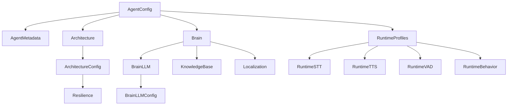

# Agent Configuration Schema Reference

This document provides a detailed reference for the `AgentConfig` schema used to configure AI Voice Agents in Tito AI. The schema is built using Pydantic v2 and is used for both validation and generating API documentation.

## Architecture Overview

The configuration follows a hierarchical structure where the root `AgentConfig` orchestrates several sub-modules:



---

## 1. Root Configuration (`AgentConfig`)

| Field | Type | Required | Description |
| :--- | :--- | :--- | :--- |
| `version` | `str` | Yes | Schema version (e.g., `1.0.0`). |
| `agent_id` | `str` | Yes | Unique identifier for the agent instance. |
| `metadata` | `AgentMetadata` | Yes | Identifying information. |
| `architecture` | `Architecture` | Yes | Core execution logic (Pipeline vs Node). |
| `brain` | `Brain` | Yes | Cognitive settings (LLM, RAG, Locale). |
| `runtime_profiles` | `RuntimeProfiles` | Yes | Technical stack (STT, TTS, VAD). |
| `capabilities` | `AgentCapabilities` | No | Tool and skill definitions (e.g., function calling). |
| `orchestration` | `OrchestrationConfig` | No | Session routing and state management. |
| `compliance` | `ComplianceConfig` | No | Privacy and safety requirements (PII redaction). |
| `observability` | `ObservabilityConfig` | No | Logging and monitoring settings. |

---

## 2. Metadata (`AgentMetadata`)

| Field | Type | Description | Example |
| :--- | :--- | :--- | :--- |
| `name` | `str` | Friendly name for the agent. | `"Luna Travel"` |
| `slug` | `str` | URL-friendly identifier. | `"luna-v3"` |
| `description` | `str` | Summary of purpose. | `"Travel assistant"` |
| `tags` | `List[str]` | Categories for filtering. | `["travel", "sales"]` |
| `language` | `str` | Primary language code. | `"es-MX"` |

---

## 3. Brain (`Brain`)

The brain defines how the agent thinks and speaks.

### BrainLLM
| Field | Type | Description |
| :--- | :--- | :--- |
| `provider` | `str` | API Provider (openai, anthropic, groq). |
| `model` | `str` | Model ID (gpt-4o, claude-3-5-sonnet). |
| `instructions`| `str` | System prompt / Persona. |
| `config` | `object` | Temperature, Max Tokens, etc. |

---

## 4. Runtime Profiles (`RuntimeProfiles`)

Defines the low-level processing stack for real-time voice.

### Session Limits (`RuntimeSessionLimits`)
| Field | Type | Description |
| :--- | :--- | :--- |
| `inactivity_timeout` | `InactivityTimeout` | Configures how the agent handles user silence. |
| `max_duration_seconds`| `int` | Maximum allowed time for the call. |

### Inactivity Timeout (`InactivityTimeout`)
| Field | Type | Description |
| :--- | :--- | :--- |
| `enabled` | `bool` | Activate/Deactivate silence detection. |
| `steps` | `List[InactivityTimeoutStep]` | Sequence of warning messages and wait times. |

### STT & TTS
| Component | Field | Description |
| :--- | :--- | :--- |
| **STT** | `provider` | deepgram, google, silero. |
| **TTS** | `provider` | cartesia, elevenlabs, playht. |
| **TTS** | `voice_id` | Identifier for the specific voice. |

---

## Example Configuration

```json
{
  "version": "1.0.0",
  "agent_id": "luna-production-001",
  "metadata": {
    "name": "Luna",
    "slug": "luna",
    "description": "Expert travel planning agent",
    "tags": ["travel", "concierge"],
    "language": "en"
  },
  "architecture": {
    "type": "pipeline"
  },
  "brain": {
    "llm": {
      "provider": "openai",
      "model": "gpt-4o",
      "instructions": "You are Luna, a friendly travel assistant."
    },
    "localization": {
      "default_locale": "en-US",
      "timezone": "America/New_York",
      "currency": "USD",
      "number_format": "{:,.2f}"
    }
  },
  "runtime_profiles": {
    "stt": { "provider": "deepgram", "model": "nova-2" },
    "tts": { "provider": "cartesia", "voice_id": "79a125e8-cd45-4c13-8a25-276b322dd2d0" },
    "session_limits": {
      "inactivity_timeout": {
        "enabled": true,
        "steps": [
          { "wait_seconds": 10, "message": ["Are you there?"] },
          { "wait_seconds": 5, "message": ["I'm still here if you need me."] }
        ]
      }
    }
  },
  "capabilities": {
    "tools": [
      {
        "name": "book_flight",
        "description": "Book a flight for the user",
        "parameters": {
          "type": "object",
          "properties": { "dest": { "type": "string" } }
        }
      }
    ]
  }
}
```
